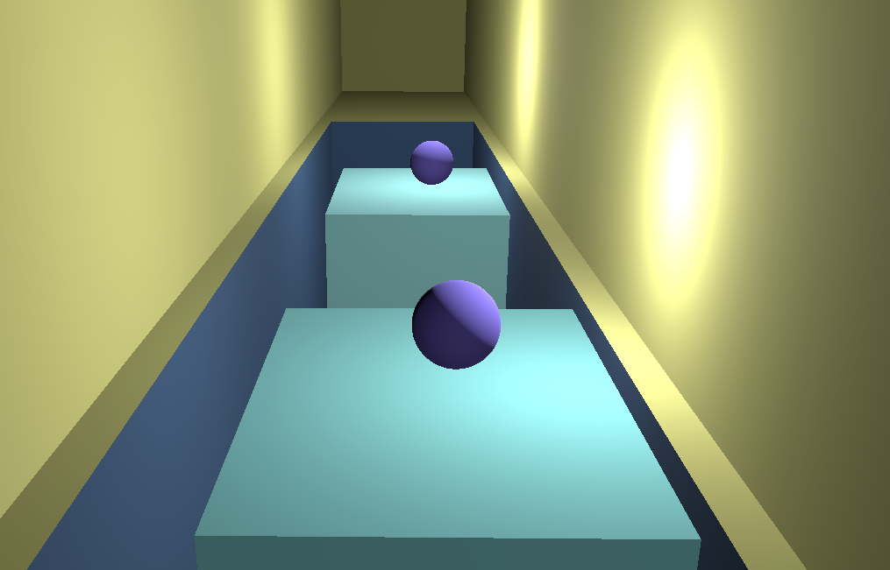

# Tutorial 7 Game Development
Basic 3D Game Mechanics & Level Design

Nama : Favian Naufal  
NPM  : 2006597802

## Penjelasan fitur Tambahan

**Eksplorasi Mechanics 3D**: Implementasi Inventory System

Pada latihan mandiri berikut, sebuah *inventory system* diimplementasikan dengan melibatkan sebuah object `Node3D` yang dinamakan "`Balls`" seperti yang diperlihatkan di bawah ini:



sistem *inventory* kemudian diimplementasikan dengan menggunakan *gklobal script* dengan fitur *autoload* yang diatur melalui *project settings*, dengan script sebagai berikut:  

`Scripts/Inventory.gd`
```
extends Node

# The Inventory
var inventory: int
signal balls_added

func add_item():
	inventory += 1
	print("Player now has ", inventory, " balls")
	emit_signal("balls_added")
```  

Lalu, sebuiah `signal` dimanfaatkan dengan melakukan *emit* pada *script* yang dihubungkan pada *UI scipt* yang di-*attach* terhadap `CanvasLayer` dengan *child node* `Label` untuk Menampilkan jumlah `Balls` yang dimiliki `Player` secara real time, dengan script berikut:

`Scripts\InventoryUI.gd`
```
extends CanvasLayer

@onready var label = $Label

func _ready():
	Inventory.connect("balls_added", update_label)
	update_label()

func update_label():
	label.text = "Balls: " + str(Inventory.inventory)
```

Serta tidak lupa untuk menambahkan signal `_on_body_entered()` terhadap objek `balls` agar `Player` dapat melakukan aksi *pick-up object* seperti berikut:

`Scripts\Balls.gd`
```
extends Area3D

func _ready():
	pass
	
func _on_body_entered(body: Node3D) -> void:
	if body.name == "Player":
		Inventory.add_item()
		queue_free()  # Remove item from the world
```